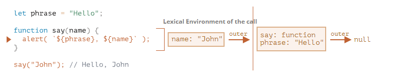

## 변수의 유효범위와 클로저

- 클로저 : 외부 변수를 기억하고, 이 외부 변수에 접근할 수 있는 함수를 의미한다. (new function으로 만드는 문법)을 제외하고는 js에서 모든 함수는 자연스럽게 클로저가 된다.
  - 클로저 변수는 호출을 해야만 접근 가능하므로, 정보 은닉에 활용된다.
  - 클로저는 함수와 함수가 선언된 어휘적 환경(Lexical Environment)의 조합이다.
- 스코프 : 변수의 유효범위(현재 접근할 수 있는 변수의 범위), 실행중인 컨텍스트에서 변수를 찾을 수 없으면 이전 실행 컨텍스트로 범위를 옮긴다. (이걸 스코프 체인 이라고 한다.)
- 렉시컬 스코프 : 함수의 호출이 아닌, 정의된 위치에 결정되는 scope를 말한다. (정적 스코프) 
- `lexical`이란, 어휘적 범위 지정(lexical scoping) 과정에서 변수가 어디에서 사용 가능한지 알기 위해 그 변수가 소스코드 내 어디에서 선언되었는지 고려한다는 것을 의미한다.

```javascript
function makeCounter() {
	let count = 0;

	return function () {
		return count++;
	};
}

let counter = makeCounter();
// console.dir(counter);
console.log(counter()); // 0
console.log(counter()); // 1
console.log(counter()); // 2
```

- 위에서 생성한 counter 함수들은 모두 독립적인 함수일까?

### Lexical Environment(렉시컬 환경)

- js에서 실행중인 함수, 코드 블럭{...}, 스크립트 전체는 `렉시컬 환경` 이라는 `내부 숨김 연관 객체(internal hidden associated object)`를 갖는다.
- 렉시컬 환경 객체는 두 부분으로 구성된다.

  - `환경 레코드(Environment Record)` - 모든 지역변수를 프로퍼티로 저장하고 있는 객체이다. this값과 같은 기타 정보도 여기에 저장된다.
  - `외부 렉시컬 환경(Outer Lexical Environment)`에 대한 참조 - 외부 코드와 관련이 있다.

- `변수`는 특수 내부 객체인 `환경 레코드(Environment Record)의 Property`이다.
  - 우리가 변수를 가져오거나, 수정하는것은 환경레코드의 프로퍼티를 가져오거나 변경한다는걸 의미한다. (오우 처음 알았음)

```javascript
let phrase = "Hello";
alert(phrase);
// 위의 코드는 렉시컬 환경이 하나만 존재합니다.
Lexical Environment (phrase : "Hello") -> outer (null) // outer lexical environ은 아무것도 없다.

```

- 스크립트 전체와 관련된 렉시컬 환경은 `global lexical Environment`라고 한다.


- 스크립트가 시작되면 스크립트 내에서 선언한 변수 전체가 렉시컬 환경에 올라간다. (pre-populated)
  - 이때는 `특수 내부 상태(special internal state)`인 `uninitialized`가 된다. js engine은 이 상태를 인지할 수 있지만, let을 만나기 전에는 참조할 수 없다. (TDZ와 관련이 있는것 같다.확실X)
- let phrase를 만나면, 이제 변수를 사용할 수 있고, 값을 할당하기 전이므로 property의 값은 `undefined`이다.
- phrase에 값이 할당된다.

### 함수 선언문

- `함수 선언문(function declaration)`으로 선언한 함수는 일반 변수와는 달리 바로 초기화 된다는 점에서 차이가 있다.
- 함수 선언문으로 선언한 함수는 렉시컬 환경이 만들어 지는 즉시 사용할 수 있다. 변수는 let을 만나야만 사용이 가능하다.
  
- 위와 같이 스크립트를 시작하자마자 실행을 할 수 있다.
- 하지만 let a = function()~~ 같은 `함수 표현식(function expression)`은 해당되지 않는다.

### 내부와 외부 렉시컬 환경

- 함수를 호출해서 실행하면 새로운 렉시컬 환경이 자동으로 만들어진다. 이 렉시컬 환경에는 함수가 넘겨받은 매개변수와 함수의 지역 변수가 저장된다.
  

- 함수를 호출하는 동안에는, 호출중인 함수를 위한 내부 렉시컬 환경과, 내부 렉시컬 환경이 가리키는 외부 렉시컬 환경을 갖게 된다.
- 위의 사진에서는 `내부 렉시컬 환경`은 실행중인 함수 say이다. 내부 렉시컬 환경에는 함수의 인자인 name에서 온 프로퍼티만 존재한다.
- 여기에서의 `외부 렉시컬 환경`은 전역 렉시컬 환경이다. phrase와 함수 say를 프로퍼티로 갖는다.
- 내부 렉시컬 환경은 외부 렉시컬 환경에 대한 참조를 갖는다. (그래서 inner가 outer를 참조할 수 있다)

### 코드에서 변수에 접근을 어떤 순서로 할까?

- 처음에는 내부 렉시컬 환경을 검색범위로 잡는다
- 내부 렉시컬 환경에서 원하는 변수를 못찾으면 외부로 확장한다.
- 전역 렉시컬 환경으로 확장될 때까지 반복한다.

- strict mode에서는 전역에서도 못찾으면 에러를 발생시킨다. (strict가 아니면 정의되지 않은 변수에 값 할당시 새로운 전역변수를 만든다. 이건 하위호환성을 위해 남아있는 기능이다.)

### 함수를 반환하는 함수

```javascript
function makeCounter() {
	let count = 0;

	return function () {
		return count++;
	};
}

let counter = makeCounter();
console.log(counter()); // 0
console.log(counter()); // 1
console.log(counter()); // 2
```

- 다시 위의 예제로 돌아와서, makeCounter()이 호출되면, 호출마다 새로운 lexical environment object가 만들어진다. 여기에 makeCounter를 실행하는데 필요한 변수들이 저장된다.

- `중요한점`

  - 모든 함수는 함수가 생성된 곳의 lexical environment를 기억한다.
  - 함수는 `[[Environment]]`라는 hidden property를 갖는데, 여기에 함수가 만들어진 곳의 렉시컬 환경에 대한 `참조`가 저장된다. (나중에 이 참조를 이용해서 처음 생성된곳의 함수로 갈 수 있는거지)
  - 참조가 있다면, 그 값을 계속 참조해서 이어쓸 수 있지 않을까?
  - 이 `[[Environment]]`는 함수가 생성될 때 딱 한번 값이 세팅되고 영원히 변하지 않는다.

- 
- 

- 중첩함수 return function에는 hidden property에 함수가 만들어진 곳의 렉시컬 환경에 대한 참조가 저장된다.
- 따라서 counter.[[Environment]]에는 {count :0}이 있는 렉시컬 환경에 대한 참조가 저장된다.
- 이 hidden property 때문에 함수의 생성 장소를 기억할 수 있게 된다.
- 
- counter()를 호출하면 새로운 렉시컬 환경이 계속 생성된다.
- 그리고 이 렉시컬 환경은 counter.[[Environment]]에 저장된 렉시컬 환경을 외부 렉시컬 환경으로 참조한다.
- 실행 흐름이 중첩함수(return func)로 넘어오면 count 변수에 대한 참조가 필요하다. 하지만 함수 내에는 변수정의가 딱히 되어있지 않다. 따라서 <empty>로 되어있다. 그렇다면 위에서 counter.[[Environment]]를 외부 렉시컬로 참조한다고 했으니, 외부를 본다. 오 counter가 있다.!!

- 

- 그렇다면 이 counter를 증가시킨다!

#### 그래서 클로저가 뭔데?

- `외부 변수를 기억하고, 이 변수에 접근할수 있는 함수를 말한다` js의 대부분의 함수는 자연스럽게 클로저이다.
- 어떻게 그렇게 되는데?
- Lexical Environment로 인한 자연스러운 흐름이다.
- [[Environment]]라는 hidden Property를 이용해서, 처음에 생성된 함수의 `렉시컬 환경에 있는 변수 값들`을 계속 참조할 수 있게된다.

```javascript
function makeArmy() {
	let shooters = [];

	let i = 0;
	while (i < 10) {
		let shooter = function () {
			// shooter 함수
			alert(i); // 몇 번째 shooter인지 출력해줘야 함
		};
		shooters.push(shooter);
		i++;
	}

	return shooters;
}

let army = makeArmy();

army[0](); // 0번째 shooter가 10을 출력함
army[5](); // 5번째 shooter 역시 10을 출력함
// 모든 shooter가 자신의 번호 대신 10을 출력하고 있음
고치는 방법은?
//var로 선언한 변수는 블록 스코프가 아닌 함수 수준 스코프를 갖습니다.
//var 선언은 함수가 시작되는 시점(전역 공간에선 스크립트가 시작되는 시점)에서 처리됩니다.
```

```javascript
function useState(init) {
	let _val = init;
	const state = () => _val;

	function setState(newVal) {
		_val = newVal;
	}

	return [state, setState];
}

let [state, setState] = useState(1);
let [state2, setState2] = useState(1);
console.log(state()); // 1
console.log(state2());
setState(2);
setState2(3);
console.log(state()); // 2
console.log(state2());
```
